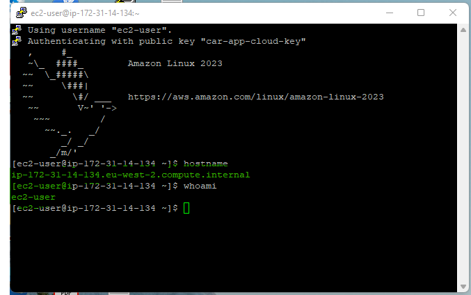

# Car Workflow Cloud App - AWS Deployment

### Create a key pair
##### Step 1

##### Step 2

##### Step 3

##### Step 4

##### Step 5
Save the private key locally for use with Putty.

### Create an ECS Cluster
##### Step 1

##### Step 2

##### Step 3

##### Step 4

### Create an EC2 Instance
##### Step 1

##### Step 2

##### Step 3

##### Step 4

##### Step 5

##### Step 6

### Create an S3 Bucket
##### Step 1

##### Step 2

##### Step 3

### Copy Spring Boot Jar to S3 bucket
##### Step 1

##### Step 2

##### Step 3

##### Step 4

##### Step 5

##### Step 6

##### Step 7

### Log into EC2 Instance
##### Step 1

##### Step 2

##### Step 3

##### Step 4

##### Step 5
 
The file is e.g. `C:\gitprojects\security\aws\car-app-cloud-cluster\car-app-cloud-key.ppk`
##### Step 6
 

### Install Java (correct version) on EC2 instance
##### Step 1

##### Step 2
 

### Get the Spring Boot Jar from S3 bucket to EC2 Instnace
##### Step 1

### Install Consul on EC2
##### Step 1

### Run Spring Boot Application
##### Step 1

##### Step 2

##### Step 3

##### Step 4

##### Step 5

##### Step 6

##### Step 7

