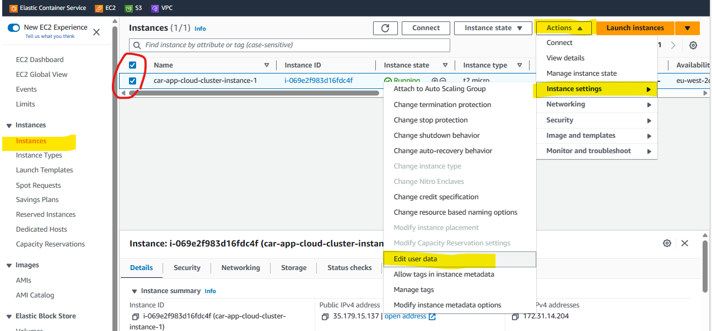
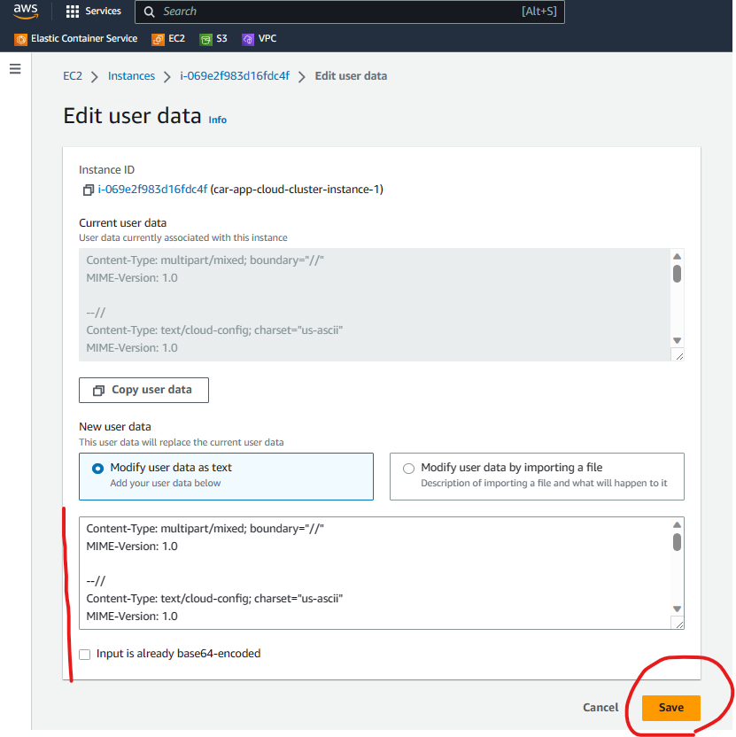
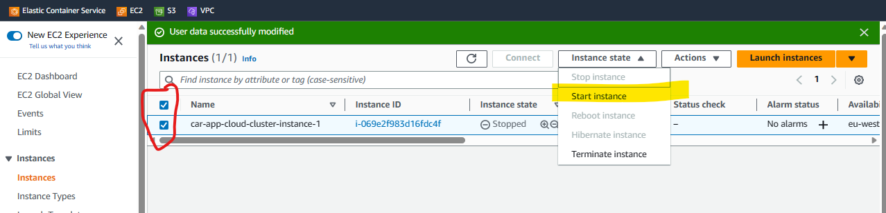
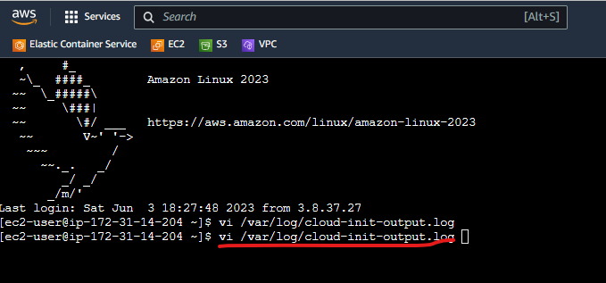
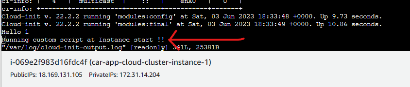
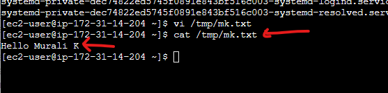

# AWS EC2 Management

### Table of Contents
1. [EC2 Console](#ec2Console)
2. [Instance Console](#instanceConsole)
3. [CLI](#CLI)

<a name="ec2Console"></a>
### EC2 Console

#### User Data
* These are items such as start up scripts to run on instance create and star.<br>


* The "script" to run.<br>


* Start the instance.<br>


* The script.<br>
````shell
Content-Type: multipart/mixed; boundary="//"
MIME-Version: 1.0

--//
Content-Type: text/cloud-config; charset="us-ascii"
MIME-Version: 1.0
Content-Transfer-Encoding: 7bit
Content-Disposition: attachment; filename="cloud-config.txt"

#cloud-config
cloud_final_modules:
- [scripts-user, always]

--//
Content-Type: text/x-shellscript; charset="us-ascii"
MIME-Version: 1.0
Content-Transfer-Encoding: 7bit
Content-Disposition: attachment; filename="userdata.txt"

#!/bin/bash
/bin/echo "Hello Murali K" >> /tmp/mk.txt
/bin/echo "Running custom script at Instance start !!"
--//--
````

* Check in Console.<br>
<br>
<br>
 <br>

* Look at log files here.<br>
````shell
[ec2-user@ip-172-31-14-204 ~]$ vi /var/log/cloud-init-output.log 
[ec2-user@ip-172-31-14-204 ~]$ vi /var/lib/cloud/instances/i-069e2f983d16fdc4f/
cloud-config.txt    handlers/           scripts/            user-data.txt       vendor-data.txt     vendor-data2.txt    
datasource          obj.pkl             sem/                user-data.txt.i     vendor-data.txt.i   vendor-data2.txt.i  
[ec2-user@ip-172-31-14-204 ~]$ vi /var/lib/cloud/instances/i-069e2f983d16fdc4f/
````
#### Example user data for launching instances
````shell
#!/bin/bash
# Use this for your user data (script from top to bottom)
# install httpd (Linux 2 version)
yum update -y
yum install -y httpd
systemctl start httpd
systemctl enable httpd
echo "<h1>Hello World from $(hostname -f)</h1>" > /var/www/html/index.html
````
<a name="instanceConsole"></a>
###  Instance Console
* Find logged in user<br>
``whoami``
* Become root user<br>
``sudo -i``
* Update available packages<br>
``yum update``
* Update available packages (no user input - e.g. user data)<br>
``yum update -y``
* List available packages - starting with java<br>
``yum list java*``
* List available packages - starting with java and version 17<br>
``yum list java* | grep 17*``
* Yum install git<br>
``yum install git``
* Yum install Java 17 (when not root user)<br>
``sudo yum install java-17-amazon-corretto.x86_64``
* Yum remove Java 17 (when not root user)<br>
``sudo yum remove java-17-amazon-corretto.x86_64``
* List java alternatives and pick version (interactive)<br>
``alternatives --config java``
* Check on listening ports<br>
``netstat -tulpn``
* Check locally running service<br>
``curl http://localhost:8080``
* ss command<br>
``sudo ss -lntp``

<a name="CLI"></a> 
### CLI
Useful AWS CLI commands
````shell
aws configure                    -^> Login - set access key, secret and default region
aws iam list-users               -^> List all the users
aws s3 ls                        -^> List all the s3 buckets
aws s3 ls car-app-cloud-storage  -^> List all the items in s3 bucket (car-app-cloud-storage)
aws s3api create-bucket --bucket car-app-cloud-storage-2 --region eu-west-2 --create-bucket-configuration LocationConstraint=eu-west-2  -^> Create a new bucket in a region
aws s3 cp s3://car-app-cloud-storage/springbootadmin-0.0.1-SNAPSHOT.jar s3://car-app-cloud-storage-2/                                   -^> Copy from one bucket to another
aws lambda list-functions        -^> List all the lambda functions
````
