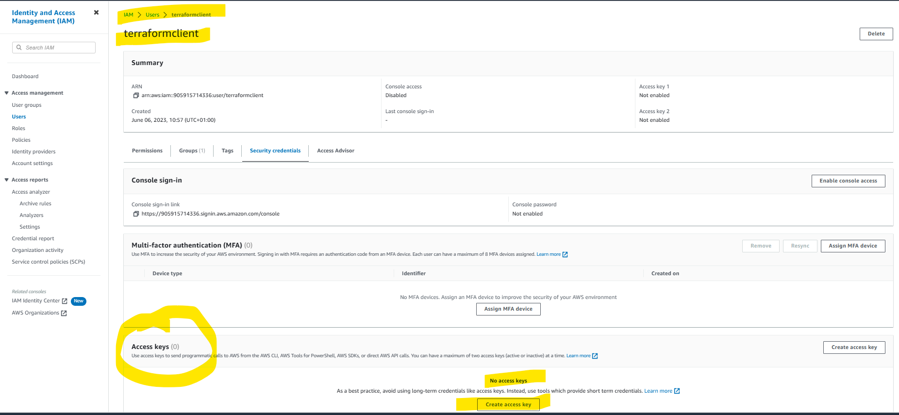
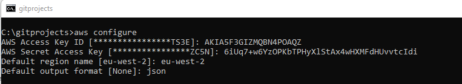
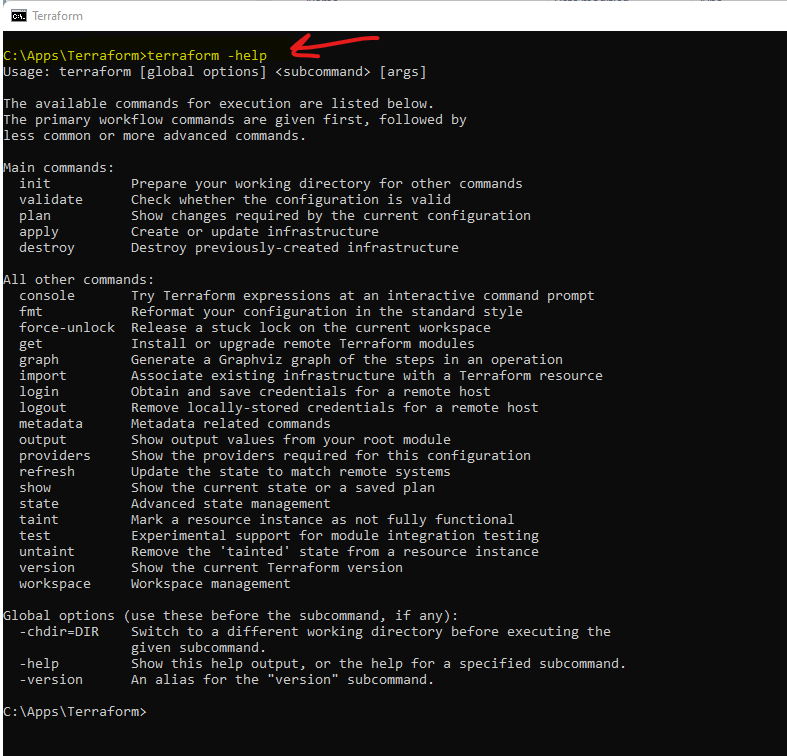

# AWS EC2 Tools

### Table of Contents

1. [AWS CLI](#awsCli)
2. [Consul](#consul)
2. [Terraform](#terraform)
3. [Nomad](#nomad)
4. [Vault](#vault)

<a name="awsCli"></a>
### AWS CLI
#### Install AWS CLI
https://docs.aws.amazon.com/cli/latest/userguide/getting-started-install.html
Ensure `C:\Program Files\Amazon\AWSCLIV2\ ` is in the PATH. 
#### Create Credentials
<br>
<br>
<br>
<br>
<br>
<br>
<br>
<br>
<br>
<br>
<br>
<br>
<br>

#### Configure AWS CLI
##### Configure
<br>
<a name="awsCliCred"></a>
##### Validate Credentials
<br>

<a name="consul"></a>
### Consul

#### Install Consul
https://www.hashicorp.com/products/consul

#### Run Consul
`consul agent -dev -node MyConsul -http-port=8501`

-node : Name of the node<br>
-http-port : The port to use (if not used defaults to 8500)<br>
````shell
C:\Apps\Consul>consul agent -dev -node MyConsul -http-port=8501
==> Starting Consul agent...
              Version: '1.15.2'
           Build Date: '2023-03-30 17:51:19 +0000 UTC'
              Node ID: '994357ab-11b0-ea96-7fa3-34e7905e18dc'
            Node name: 'MyConsul'
           Datacenter: 'dc1' (Segment: '<all>')
               Server: true (Bootstrap: false)
          Client Addr: [127.0.0.1] (HTTP: 8501, HTTPS: -1, gRPC: 8502, gRPC-TLS: 8503, DNS: 8600)
         Cluster Addr: 127.0.0.1 (LAN: 8301, WAN: 8302)
    Gossip Encryption: false
     Auto-Encrypt-TLS: false
            HTTPS TLS: Verify Incoming: false, Verify Outgoing: false, Min Version: TLSv1_2
             gRPC TLS: Verify Incoming: false, Min Version: TLSv1_2
     Internal RPC TLS: Verify Incoming: false, Verify Outgoing: false (Verify Hostname: false), Min Version: TLSv1_2
````
Check in Conul.<br>
http://localhost:8501/ui/dc1/services
<br>

#### Service registry
E.g. in ``application.yml``
````yaml
spring:
  cloud:
    discovery:
      enabled: true
    consul:
      host: localhost
      port: 8501
      discovery:
        instanceId: ${spring.application.name}:${spring.application.instance_id:${server.port}:${random.value}}
      config:
        enabled: false
````

<a name="terraform"></a>
### Terraform

#### Install Terraform
https://developer.hashicorp.com/terraform/downloads

#### Setup Terraform
##### Run Terraform
<br>
##### Validate it is installed
``terraform -help``<br>
<br>
##### Create the Provider block in .tf file
Start to create the .tf file with the provider "aws".<br> 
The profile default must match the AWS CLI profile [See Here](#awsCliCred).<br>
<br>
##### Install the aws provider
``terraform init``<br>
<br>
##### Create the Resources Block in .tf file
<br>
##### Set up the infrastructure
Run ```terraform apply```
```shell
PS C:\gitprojects\devops-tools\src\main\resources\terraform> C:\Apps\Terraform\terraform.exe apply

Terraform used the selected providers to generate the following execution plan. Resource actions are indicated with the following symbols:
  + create

Terraform will perform the following actions:

  # aws_instance.car-cloud-app-cluster-tf will be created
  + resource "aws_instance" "car-cloud-app-cluster-tf" {
      + ami                                  = "ami-0e1c5be2aa956338b"
      + arn                                  = (known after apply)
      + associate_public_ip_address          = (known after apply)
      + availability_zone                    = (known after apply)
      + cpu_core_count                       = (known after apply)
      + cpu_threads_per_core                 = (known after apply)
      + disable_api_stop                     = (known after apply)
      + disable_api_termination              = (known after apply)
      + ebs_optimized                        = (known after apply)
      + get_password_data                    = false
      + host_id                              = (known after apply)
      + host_resource_group_arn              = (known after apply)
      + iam_instance_profile                 = (known after apply)
      + id                                   = (known after apply)
      + instance_initiated_shutdown_behavior = (known after apply)
      + instance_state                       = (known after apply)
      + instance_type                        = "t2.micro"
      + ipv6_address_count                   = (known after apply)
      + ipv6_addresses                       = (known after apply)
      + key_name                             = (known after apply)
      + monitoring                           = (known after apply)
      + outpost_arn                          = (known after apply)
      + password_data                        = (known after apply)
      + placement_group                      = (known after apply)
      + placement_partition_number           = (known after apply)
      + primary_network_interface_id         = (known after apply)
      + private_dns                          = (known after apply)
      + private_ip                           = (known after apply)
      + public_dns                           = (known after apply)
      + public_ip                            = (known after apply)
      + secondary_private_ips                = (known after apply)
      + security_groups                      = (known after apply)
      + source_dest_check                    = true
      + subnet_id                            = (known after apply)
  Terraform will perform the actions described above.
  Only 'yes' will be accepted to approve.

  Enter a value: yes

aws_instance.car-cloud-app-cluster-tf: Creating...
aws_instance.car-cloud-app-cluster-tf: Still creating... [10s elapsed]
aws_instance.car-cloud-app-cluster-tf: Still creating... [20s elapsed]
aws_instance.car-cloud-app-cluster-tf: Creation complete after 21s [id=i-076d3780758b4b142]

Apply complete! Resources: 1 added, 0 changed, 0 destroyed.
```
##### Verify the instance is up in EC2 console
<br>
##### Teardown the infrastructure
Run ```terraform destroy```
```shell
PS C:\gitprojects\devops-tools\src\main\resources\terraform> C:\Apps\Terraform\terraform.exe destroy
aws_instance.car-cloud-app-cluster-tf: Refreshing state... [id=i-076d3780758b4b142]

Terraform used the selected providers to generate the following execution plan. Resource actions are indicated with the following symbols:
  - destroy

Terraform will perform the following actions:

  # aws_instance.car-cloud-app-cluster-tf will be destroyed
  - resource "aws_instance" "car-cloud-app-cluster-tf" {
      - ami                                  = "ami-0e1c5be2aa956338b" -> null
      - arn                                  = "arn:aws:ec2:eu-west-2:905915714336:instance/i-076d3780758b4b142" -> null
      - associate_public_ip_address          = true -> null
      - availability_zone                    = "eu-west-2b" -> null
      - cpu_core_count                       = 1 -> null
      - cpu_threads_per_core                 = 1 -> null
      - disable_api_stop                     = false -> null
      - disable_api_termination              = false -> null
      - ebs_optimized                        = false -> null
      - get_password_data                    = false -> null
      - hibernation                          = false -> null
      - id                                   = "i-076d3780758b4b142" -> null
      - instance_initiated_shutdown_behavior = "stop" -> null
      - instance_state                       = "running" -> null
      - instance_type                        = "t2.micro" -> null
      - ipv6_address_count                   = 0 -> null
      - ipv6_addresses                       = [] -> null
      - monitoring                           = false -> null
      - placement_partition_number           = 0 -> null
      - primary_network_interface_id         = "eni-0d4cc5175a1beb930" -> null
      - private_dns                          = "ip-172-31-46-170.eu-west-2.compute.internal" -> null
      - private_ip                           = "172.31.46.170" -> null
      - public_dns                           = "ec2-13-41-193-218.eu-west-2.compute.amazonaws.com" -> null
      - public_ip                            = "13.41.193.218" -> null
      - secondary_private_ips                = [] -> null
      - security_groups                      = [
          - "default",
        ] -> null
      - source_dest_check                    = true -> null
      - subnet_id                            = "subnet-96b037da" -> null
      - tags                                 = {
          - "Name" = "MyTerraformCluster"
        } -> null
      - tags_all                             = {
          - "Name" = "MyTerraformCluster"
        } -> null
      - tenancy                              = "default" -> null
      - user_data_replace_on_change          = false -> null
      - vpc_security_group_ids               = [
          - "sg-54e4e52e",
        ] -> null

      - capacity_reservation_specification {
          - capacity_reservation_preference = "open" -> null
        }

      - cpu_options {
          - core_count       = 1 -> null
          - threads_per_core = 1 -> null
        }

      - credit_specification {
          - cpu_credits = "standard" -> null
        }

      - enclave_options {
          - enabled = false -> null
        }

      - maintenance_options {
          - auto_recovery = "default" -> null
        }

      - metadata_options {
          - http_endpoint               = "enabled" -> null
          - http_put_response_hop_limit = 2 -> null
          - http_tokens                 = "required" -> null
          - instance_metadata_tags      = "disabled" -> null
        }

      - private_dns_name_options {
          - enable_resource_name_dns_a_record    = false -> null
          - enable_resource_name_dns_aaaa_record = false -> null
          - hostname_type                        = "ip-name" -> null
        }

      - root_block_device {
          - delete_on_termination = true -> null
          - device_name           = "/dev/xvda" -> null
          - encrypted             = false -> null
          - iops                  = 3000 -> null
          - tags                  = {} -> null
          - throughput            = 125 -> null
          - volume_id             = "vol-0f4b0d718cd555fe4" -> null
          - volume_size           = 8 -> null
          - volume_type           = "gp3" -> null
        }
    }

Plan: 0 to add, 0 to change, 1 to destroy.

Do you really want to destroy all resources?
  Terraform will destroy all your managed infrastructure, as shown above.
  There is no undo. Only 'yes' will be accepted to confirm.

  Enter a value: yes

aws_instance.car-cloud-app-cluster-tf: Destroying... [id=i-076d3780758b4b142]
aws_instance.car-cloud-app-cluster-tf: Still destroying... [id=i-076d3780758b4b142, 10s elapsed]
aws_instance.car-cloud-app-cluster-tf: Still destroying... [id=i-076d3780758b4b142, 20s elapsed]
aws_instance.car-cloud-app-cluster-tf: Still destroying... [id=i-076d3780758b4b142, 30s elapsed]
aws_instance.car-cloud-app-cluster-tf: Destruction complete after 40s

Destroy complete! Resources: 1 destroyed.
```
##### Verify the instance is down in EC2 console
<br>
##### Variable substitution in.tf
<br>
<br>
Run ```terraform apply``` <br>
<br>
Run ```terraform apply -var "instance_name=VarMyTerraformCluster4"``` <br>
<br>
<br>
<br>
Run<br>
```terraform apply``` <br>
```terraform output``` <br>
```shell
instance_id = "i-02352e718f2346efb"
instance_public_ip = "3.8.185.176"

```
##### Useful terraform commands
```terraform init```    -> Init the provider e.g. aws<br>
```terraform apply```   -> Setup infrastructure<br>
```terraform destroy``` -> Tear down infrastructure<br>

<a name="nomad"></a>
### Nomad
#### Install Nomad
https://developer.hashicorp.com/nomad/downloads?product_intent=nomad

#### Run Nomad
`nomad agent -dev -config=nomad-config.hcl`

The ``nomad-config.hcl`` file is a [configuration](https://developer.hashicorp.com/nomad/docs/configuration) file that Nomad uses to configure itself.

Example (nomad-config.hcl): 
1. The ports are overridden
2. A [Consul](#consul) server is defined, for Nomad to register with
3. Log level at INFO with a specific log file
4. Data directory for Nomad to store data
```shell
server {
  enabled = true
  data_dir = "C:\\Apps\\Nomad"
}
ports {
  http = 14646
  rpc  = 14647
  serf = 14648
}
client {
  enabled = true
}
consul {
  address = "localhost:8501"
}
log_level = "INFO"
log_file = "C:\\Apps\\Nomad\\nomad.log"
```
````shell
C:\Apps\Nomad>nomad agent -dev -config=nomad-config.hcl
==> Loaded configuration from nomad-config.hcl
==> Starting Nomad agent...
==> Nomad agent configuration:

       Advertise Addrs: HTTP: 127.0.0.1:14646; RPC: 127.0.0.1:14647; Serf: 127.0.0.1:14648
            Bind Addrs: HTTP: [127.0.0.1:14646]; RPC: 127.0.0.1:14647; Serf: 127.0.0.1:14648
                Client: true
             Log Level: DEBUG
                Region: global (DC: dc1)
                Server: true
               Version: 1.5.6

==> Nomad agent started! Log data will stream in below:
````

````shell
    2023-06-14T14:27:16.203+0100 [INFO]  nomad: adding server: server="DESKTOP-UUK27G8.global (Addr: 127.0.0.1:14647) (DC: dc1)"
    2023-06-14T14:27:16.206+0100 [INFO]  agent: detected plugin: name=raw_exec type=driver plugin_version=0.1.0
    2023-06-14T14:27:16.206+0100 [INFO]  agent: detected plugin: name=exec type=driver plugin_version=0.1.0
    2023-06-14T14:27:16.206+0100 [INFO]  agent: detected plugin: name=qemu type=driver plugin_version=0.1.0
    2023-06-14T14:27:16.206+0100 [INFO]  agent: detected plugin: name=java type=driver plugin_version=0.1.0
    2023-06-14T14:27:16.206+0100 [INFO]  agent: detected plugin: name=docker type=driver plugin_version=0.1.0
````

2023-06-14T14:27:16.206+0100 [INFO]  agent: detected plugin: ***name=java*** type=driver plugin_version=0.1.0<br>
***name=java*** tells us that, later, we cant create Nomad jobs with ***driver = "java"*** <br> 

Check in Nomad.<br>
http://localhost:14646/ui/jobs
<br>
Check Nomad is registerd on Consul.<br>
<br>
<br>
<br>

#### Run a Nomad job
Create a Nomad job file as speified [here](https://developer.hashicorp.com/nomad/docs/job-specification).
````shell
job "car-workflow-cloud-app-job" {
  datacenters = ["dc1"]
  type        = "service"
  group "car-workflow-cloud-app-group" {
    count = 2 // Run 2 instances
    task "car-workflow-cloud-app" {
      driver = "java" // This can be java. docker etc.
      config {
        jar_path    = "C:\\gitprojects\\car-workflow-cloud-app\\target\\car-workflow-cloud-app-0.0.1-SNAPSHOT.jar"
        jvm_options = ["-Xms256m", "-Xmx512m"]
        args        = []
      }
      resources {
        cpu    = 100 // MHz
        memory = 1024 // MB
      }
    }
  }
}
````
As the port is not the default (4646) set the NOMAD_ADDR variable.<br>
````set NOMAD_ADDR=http://127.0.0.1:14646````<br>
Then run the nomad job<br>
````nomad run car-app-cloud-cluster.nomad````<br>
Check the job logs
````shell
C:\gitprojects\devops-tools\src\main\resources\nomad>nomad run car-app-cloud-cluster.nomad
==> 2023-06-14T15:37:05+01:00: Monitoring evaluation "6f7cdf25"
    2023-06-14T15:37:05+01:00: Evaluation triggered by job "car-workflow-cloud-app-job"
    2023-06-14T15:37:06+01:00: Evaluation within deployment: "65d2960f"
    2023-06-14T15:37:06+01:00: Allocation "43bab04d" created: node "116bc5e1", group "car-workflow-cloud-app-group"
    2023-06-14T15:37:06+01:00: Allocation "a771e284" created: node "116bc5e1", group "car-workflow-cloud-app-group"
    2023-06-14T15:37:06+01:00: Evaluation status changed: "pending" -> "complete"
==> 2023-06-14T15:37:06+01:00: Evaluation "6f7cdf25" finished with status "complete"
==> 2023-06-14T15:37:06+01:00: Monitoring deployment "65d2960f"

2023-06-14T15:37:06+01:00
ID          = 65d2960f
Job ID      = car-workflow-cloud-app-job
Job Version = 0
Status      = running
Description = Deployment is running

Deployed
Task Group                    Desired  Placed  Healthy  Unhealthy  Progress Deadline
car-workflow-cloud-app-group  2        2       0        0          2023-06-14T15:47:05+01:00
````
Check in Nomad post job run<br>
<br>
<br>
<br>
<br>
Check in Consul post job run<br>
Ensure the individual SpringBoot app has Consul config<br>
```yaml
spring:
  application:
    name: car-workflow-cloud-app
  cloud:
    consul:              # <----- THIS IS PRESENT
      host: localhost
      port: 8501
```
<br>
<br>


<a name="vault"></a>
### Vault
#### Install Vault
https://developer.hashicorp.com/vault/downloads

#### Create TLS Keys 
The private and public keys generated to enable HTTPS, must be in **PEM** format.<br>
Vault requires subjectAltName in the keys<br>
Create a file called san.cnf with the following content
```shell
[req]
default_bits  = 2048
distinguished_name = req_distinguished_name
req_extensions = req_ext
x509_extensions = v3_req
prompt = no
[req_distinguished_name]
countryName = XX
stateOrProvinceName = N/A
localityName = N/A
organizationName = Self-signed certificate
commonName = 120.0.0.1: Self-signed certificate
[req_ext]
subjectAltName = @alt_names
[v3_req]
subjectAltName = @alt_names
[alt_names]
IP.1 = 127.0.0.1
```
Then run the following openssh command to generate the private and public keys.<br>
```shell
openssl req -x509 -newkey rsa:4096 -nodes -out my-vault-cert.pem -keyout my-vault-key.pem -config san.cnf -days 3650
```
Ensure that ```-config san.cnf``` is pointing to  the san.cnf created above.<br>
This will generate the public key ``my-vault-cert.pem`` and private key ``my-vault-key.pem``.<br>

#### Run Vault
Create the Vault run config file e.g.``vault-config.hcl``
The ``vault-config.hcl`` file is a [configuration](https://developer.hashicorp.com/vault/docs/configuration) file that Nomad uses to configure itself.
Here the storage in specified as file so is persistent across server restarts<br>
UI is enabled<br>
TLS is enabled and the private and public key specified above are listed<br>
```shell
ui = true # UI @ 127.0.0.1:8200/ui

disable_mlock = true

storage "file" {
  path = "vault-data"
}

listener "tcp" {
  address       = "127.0.0.1:8200"
  tls_disable   = false
  tls_cert_file = "my-vault-cert.pem"
  tls_key_file  = "my-vault-key.pem"
}

api_addr = "https://127.0.0.1:8200"
cluster_addr = "https://127.0.0.1:8201"
```

Then start the Vault server (pointing it to the vault-config.hcl created above)<br>
``vault server -config vault-config.hcl``

````shell
C:\Apps\Vault>vault server -config vault-config.hcl
==> Vault server configuration:

             Api Address: https://127.0.0.1:8200
                     Cgo: disabled
         Cluster Address: https://127.0.0.1:8201
   Environment Variables: , , ALLUSERSPROFILE, APPDATA, COMPUTERNAME, ComSpec, CommonProgramFiles, CommonProgramFiles(x86), CommonProgramW6432, DriverData, GODEBUG, HOMEDRIVE, HOMEPATH, IntelliJ IDEA Community Edition, JAVA_HOME, LOCALAPPDATA, LOGONSERVER, M2_HOME, NUMBER_OF_PROCESSORS, OS, OneDrive, OneDriveConsumer, PATHEXT, PROCESSOR_ARCHITECTURE, PROCESSOR_IDENTIFIER, PROCESSOR_LEVEL, PROCESSOR_REVISION, PROMPT, PSModulePath, PUBLIC, Path, ProgramData, ProgramFiles, ProgramFiles(x86), ProgramW6432, SESSIONNAME, SystemDrive, SystemRoot, TEMP, TMP, USERDOMAIN, USERDOMAIN_ROAMINGPROFILE, USERNAME, USERPROFILE, ZES_ENABLE_SYSMAN, windir
              Go Version: go1.20.4
              Listener 1: tcp (addr: "127.0.0.1:8200", cluster address: "127.0.0.1:8201", max_request_duration: "1m30s", max_request_size: "33554432", tls: "enabled")
               Log Level:
                   Mlock: supported: false, enabled: false
           Recovery Mode: false
                 Storage: file
                 Version: Vault v1.13.3, built 2023-06-06T18:12:37Z
             Version Sha: 3bedf816cbf851656ae9e6bd65dd4a67a9ddff5e

==> Vault server started! Log data will stream in below:

2023-06-15T18:47:22.263+0100 [INFO]  proxy environment: http_proxy="" https_proxy="" no_proxy=""
2023-06-15T18:47:22.264+0100 [INFO]  core: Initializing version history cache for core
````

#### Initialize Vault
In a cmd window<br>
```shell
set VAULT_ADDR=https://127.0.0.1:8200
set VAULT_CACERT=my-vault-cert.pem
vault operator init
```
This should output<br>
```shell
Unseal Key 1: <key 1>
Unseal Key 2: <key 2>
Unseal Key 3: <key 3>
Unseal Key 4: <key 4>
Unseal Key 5: <key 5>

Initial Root Token: <root_token>

Vault initialized with 5 key shares and a key threshold of 3. Please securely
distribute the key shares printed above. When the Vault is re-sealed,
restarted, or stopped, you must supply at least 3 of these keys to unseal it
before it can start servicing requests.

Vault does not store the generated root key. Without at least 3 keys to
reconstruct the root key, Vault will remain permanently sealed!

It is possible to generate new unseal keys, provided you have a quorum of
existing unseal keys shares. See "vault operator rekey" for more information.
```
This gives you 5 unseal tokens and 1 root token. key 1-5 and root_token will display the actual token. Deleted here.<br>

Check the vault status using ``vault status``
```shell
C:\gitprojects\devops-tools\src\main\resources\vault>vault status
Key                Value
---                -----
Seal Type          shamir
Initialized        true
Sealed             true
Total Shares       5
Threshold          3
Unseal Progress    0/3
Unseal Nonce       n/a
Version            1.13.3
Build Date         2023-06-06T18:12:37Z
Storage Type       file
HA Enabled         false
```
This shows that the vault is "Sealed" ``Sealed             true`` and the needs 3 unseal keys to unseal ``Unseal Progress    0/3``.
A vault needs to be unsealed in order to interaction with it via the API.

#### Unseal the Vault
```shell
set VAULT_TOKEN=<root_token>
vault operator unseal <unseal_key_1>
vault operator unseal <unseal_key_2>
vault operator unseal <unseal_key_3>
```
Check the vault status
```shell
C:\gitprojects\devops-tools\src\main\resources\vault>vault status
Key             Value
---             -----
Seal Type       shamir
Initialized     true
Sealed          false
Total Shares    5
Threshold       3
Version         1.13.3
Build Date      2023-06-06T18:12:37Z
Storage Type    file
Cluster Name    vault-cluster-06400554
Cluster ID      e58e0344-d1d6-4f64-06b0-5fb7c0b4aa67
HA Enabled      false
```
This ``Sealed          false`` indicated that the vault is unsealed.

#### Create a Vault policy
Create ``read-only-policy.hcl`` file<br>
```hcl
path "secret/kv/murali/readonly" {
  capabilities = ["read"]
}
````

Create ``admin-policy.hcl`` file<br>
```hcl
path "secret/kv/murali/*" {
  capabilities = ["create", "update", "delete"]
}
```

Validate and format the policy files<br>
```hcl
vault policy fmt admin-policy.hcl
vault policy fmt read-only-policy.hcl
```

Write the policy(s) to vault<br>
```hcl
vault policy write admin-policy admin-policy.hcl
vault policy write read-only-policy read-only-policy.hcl
```
List the policy(s) and read the details<br>
```hcl
vault policy list
vault policy read admin-policy
vault policy read read-only-policy
```
You should see<br>
```hcl
C:\Apps\Vault>vault policy list
admin-policy
default
read-only-policy
root
```
```hcl
C:\Apps\Vault>vault policy read admin-policy
path "secret/kv/murali/*" {
  capabilities = ["create", "update", "delete"]
}
```
#### Create a Vault secret
Create a secret in Vault for a particular path and type<br>
```hcl
C:\Apps\Vault>vault secrets enable -path=secret/ kv-v2
Success! Enabled the kv-v2 secrets engine at: secret/
```
Then validate that it has been created in Vault<br>
```hcl
C:\Apps\Vault>vault secrets list
Path          Type         Accessor              Description
----          ----         --------              -----------
cubbyhole/    cubbyhole    cubbyhole_d0ffd980    per-token private secret storage
identity/     identity     identity_a3d1e351     identity store
secret/       kv           kv_85967983           n/a
sys/          system       system_5698ee91       system endpoints used for control, policy and debugging
```

Now that a secrets has been created in path ``secret/`` the ``path`` in the poicy(s) ``admin-policy`` and ``read-only-policy``
i.e. these stanza(s) ``path "secret/kv/murali/*"`` and ``path "secret/kv/murali/readonly"`` associate a policy with a key value store in a path.
#### Create a token with the new policy
A token is like a username, in that it can be used to login. So as there is a secret engine in a path and a policy for the path. Creating a token is like creating a user with access to that policy, which allows an action (read, write, update, delete etc.) on that secret in that path.

#### Create a new token in Vault and login to Vault
Create a new token for a policy<br>
```hcl
C:\Apps\Vault>vault token create -policy=admin-policy
Key                  Value
---                  -----
token                <new token for policy>
token_accessor       RLkSejNEWPvHQ0hKBSsSSlql
token_duration       768h
token_renewable      true
token_policies       ["admin-policy" "default"]
identity_policies    []
policies             ["admin-policy" "default"]```
```
Login to Vault with the new token, and validate that the policy exits<br>
```hcl
C:\Apps\Vault>>vault login <new token for policy>

Success! You are now authenticated. The token information displayed below
is already stored in the token helper. You do NOT need to run "vault login"
again. Future Vault requests will automatically use this token.

Key                  Value
---                  -----
token                <new token for policy>
token_accessor       <token accessor>
token_duration       767h58m51s
token_renewable      true
token_policies       ["admin-policy" "default"]
identity_policies    []
policies             ["admin-policy" "default"]
```

#### Interact with the Vault secret
Put some key value pairs in secret path ``secret/kv/murali``<br>
```hcl
C:\Apps\Vault>vault kv put secret/kv/murali First=Mura Last=Karu Country=UK Location=London
==== Secret Path ====
secret/data/kv/murali

======= Metadata =======
Key                Value
---                -----
created_time       2023-06-16T05:48:47.8513303Z
custom_metadata    <nil>
deletion_time      n/a
destroyed          false
version            1
```
Retrieve the values in secret path ``secret/kv/murali``<br>
```hcl
C:\Apps\Vault>vault kv get secret/kv/murali
==== Secret Path ====
secret/data/kv/murali

======= Metadata =======
Key                Value
---                -----
created_time       2023-06-16T05:48:47.8513303Z
custom_metadata    <nil>
deletion_time      n/a
destroyed          false
version            1

====== Data ======
Key         Value
---         -----
Country     UK
First       Mura
Last        Karu
Location    London
```

#### Clean up the vault
Revoke a token and try to login with that token<br>
```hcl
C:\Apps\Vault>vault token revoke <new_token>
Success! Revoked token (if it existed)

C:\Apps\Vault>vault login <new_token>
Error authenticating: error looking up token: Error making API request.

URL: GET https://127.0.0.1:8200/v1/auth/token/lookup-self
Code: 403. Errors:

* permission denied
```

Disable a secret and check it is not in the secrets list<br>
```hcl
C:\Apps\Vault>vault secrets disable secret/
Success! Disabled the secrets engine (if it existed) at: secret/

C:\Apps\Vault>vault secrets list
Path          Type         Accessor              Description
----          ----         --------              -----------
cubbyhole/    cubbyhole    cubbyhole_d0ffd980    per-token private secret storage
identity/     identity     identity_a3d1e351     identity store
sys/          system       system_5698ee91       system endpoints used for control, policy and debugging
```
Delete a policy and ensure it does not exist<br>
```hcl
C:\Apps\Vault>vault policy delete admin-policy
Success! Deleted policy: admin-policy

C:\Apps\Vaultt>vault policy list
default
read-only-policy
root
```


